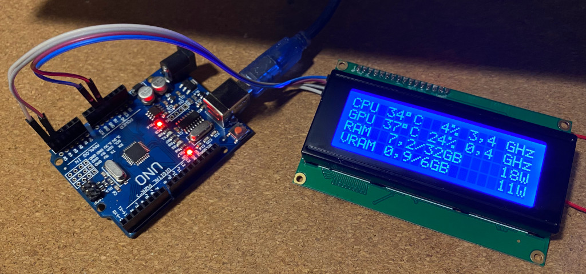

# Sensors Monitor

# Hardware

* Arduino Uno (or compatibility)
* LCD 2004 with I2C

# Visual Studio Project

You have to change code of `Sync` method in `MainForm.cs` file for your PC configuration. My CPU is Ryzen 2700 and graphic card is GeForce GTX 1660S.

# Arduino Project

See `ArduinoProject\ArduinoProject.ino`.

# Third party

* OpenHardwareLibrary - https://github.com/openhardwaremonitor/openhardwaremonitor
* App icon - thanks to [@woodyart](https://github.com/woodyart)

# Materials

* Arduino PC Monitor - https://www.hackster.io/zakrzu/arduino-pc-monitor-66c07a

